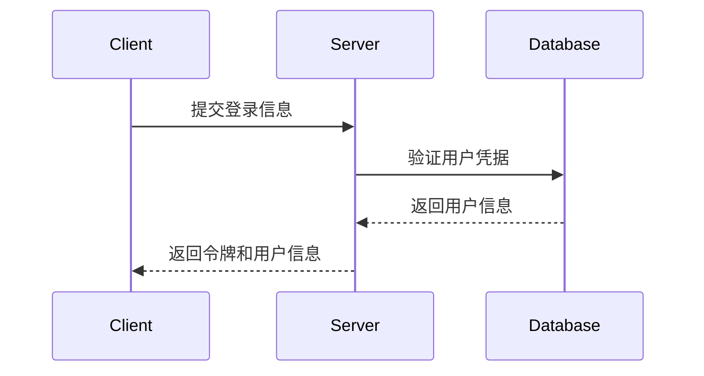
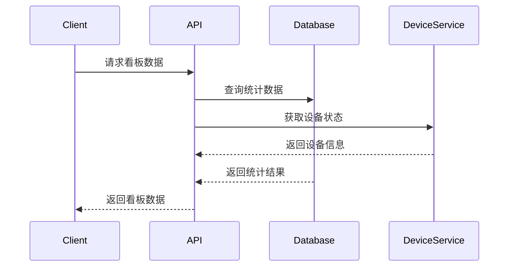

# 📖 智能监控系统API接口文档

## 1. 用户认证与管理

### 1.1 用户登录

**接口名称：** 用户登录验证
**功能描述：** 用户通过用户名和密码登录系统，返回认证令牌
**接口地址：** /api/auth/login
**请求方式：** POST

#### 功能说明
验证用户身份信息，成功后返回JWT令牌用于后续API调用的身份验证。



#### 请求参数
```json
{
  "username": "admin",
  "password": "123456"
}
```

| 参数名 | 类型 | 必填 | 说明 | 示例值 |
|-------|------|-----|------|--------|
| username | string | 是 | 用户名 | admin |
| password | string | 是 | 密码 | 123456 |

#### 响应参数
```json
{
  "error": 0,
  "body": {
    "token": "eyJhbGciOiJIUzI1NiIsInR5cCI6IkpXVCJ9...",
    "user_info": {
      "id": 1,
      "username": "admin",
      "role": "管理员",
      "permissions": ["UserManagement", "DeviceManagement"],
      "last_login": "2024-01-20 10:30:00"
    }
  },
  "message": "登录成功",
  "success": true
}
```

| 参数名 | 类型 | 必填 | 说明 | 示例值 |
|-------|------|-----|------|--------|
| error | int | 是 | 错误码 | 0 |
| body | object | 是 | 响应数据 | |
| body.token | string | 是 | JWT认证令牌 | eyJhbGciOiJIUzI1NiIsInR5cCI6IkpXVCJ9... |
| body.user_info | object | 是 | 用户信息 | |
| body.user_info.id | int | 是 | 用户ID | 1 |
| body.user_info.username | string | 是 | 用户名 | admin |
| body.user_info.role | string | 是 | 用户角色 | 管理员 |
| body.user_info.permissions | array | 是 | 用户权限列表 | ["UserManagement"] |
| body.user_info.last_login | string | 是 | 上次登录时间 | 2024-01-20 10:30:00 |
| message | string | 是 | 响应消息 | 登录成功 |
| success | bool | 是 | 是否成功 | true |

### 1.2 获取用户列表

**接口名称：** 获取用户列表
**功能描述：** 分页获取系统用户列表，支持搜索和筛选
**接口地址：** /api/users
**请求方式：** GET

#### 请求参数
| 参数名 | 类型 | 必填 | 说明 | 示例值 |
|-------|------|-----|------|--------|
| page | int | 否 | 页码（默认1） | 1 |
| page_size | int | 否 | 每页数量（默认10） | 10 |
| username | string | 否 | 用户名筛选 | admin |
| role | string | 否 | 角色筛选 | 管理员 |
| status | string | 否 | 状态筛选 | 启用 |

#### 响应参数
```json
{
  "error": 0,
  "body": {
    "users": [
      {
        "id": 1,
        "username": "admin",
        "role": "管理员",
        "status": "启用",
        "permissions": ["UserManagement", "DeviceManagement"],
        "create_time": "2024-01-01 10:00:00",
        "last_login": "2024-01-20 10:30:00"
      }
    ],
    "total": 25,
    "page": 1,
    "page_size": 10
  },
  "message": "获取用户列表成功",
  "success": true
}
```

### 1.3 添加用户

**接口名称：** 添加新用户
**功能描述：** 创建新的系统用户账号
**接口地址：** /api/users
**请求方式：** POST

#### 请求参数
```json
{
  "username": "user01",
  "password": "123456",
  "role": "操作员",
  "status": "启用",
  "permissions": ["DeviceManagement", "Detection"]
}
```

#### 响应参数
```json
{
  "error": 0,
  "body": {
    "user_id": 26
  },
  "message": "用户添加成功",
  "success": true
}
```

### 1.4 批量添加用户

**接口名称：** 批量添加用户
**功能描述：** 通过Excel文件批量创建用户账号
**接口地址：** /api/users/batch
**请求方式：** POST
**Content-Type：** multipart/form-data

#### 请求参数
| 参数名 | 类型 | 必填 | 说明 | 示例值 |
|-------|------|-----|------|--------|
| file | file | 是 | Excel用户列表文件 | users.xlsx |

#### 响应参数
```json
{
  "error": 0,
  "body": {
    "success_count": 10,
    "failed_count": 2,
    "failed_records": [
      {
        "row": 3,
        "username": "user03",
        "reason": "用户名已存在"
      }
    ]
  },
  "message": "批量添加用户完成",
  "success": true
}
```

### 1.5 更新用户信息

**接口名称：** 更新用户信息
**功能描述：** 更新指定用户的基本信息和权限
**接口地址：** /api/users/{user_id}
**请求方式：** PUT

### 1.6 删除用户

**接口名称：** 删除用户
**功能描述：** 删除指定的用户账号
**接口地址：** /api/users/{user_id}
**请求方式：** DELETE

### 1.7 重置用户密码

**接口名称：** 重置用户密码
**功能描述：** 重置指定用户的登录密码
**接口地址：** /api/users/{user_id}/reset-password
**请求方式：** POST

### 1.8 获取角色列表

**接口名称：** 获取系统角色列表
**功能描述：** 获取系统中所有可用的用户角色
**接口地址：** /api/roles
**请求方式：** GET

#### 响应参数
```json
{
  "error": 0,
  "body": {
    "roles": [
      {
        "id": 1,
        "name": "管理员",
        "description": "系统管理员，拥有所有权限",
        "permissions": ["*"],
        "is_default": true
      },
      {
        "id": 2,
        "name": "操作员",
        "description": "普通操作员，可自定义权限",
        "permissions": ["DeviceManagement", "Detection"],
        "is_default": true
      }
    ]
  },
  "message": "获取角色列表成功",
  "success": true
}
```

### 1.9 添加角色

**接口名称：** 添加自定义角色
**功能描述：** 创建新的操作员角色并配置权限
**接口地址：** /api/roles
**请求方式：** POST

#### 请求参数
```json
{
  "name": "设备管理员",
  "description": "专门负责设备管理的操作员",
  "permissions": ["DeviceManagement", "DeviceConfig", "AlgorithmConfig"]
}
```

### 1.10 更新角色权限

**接口名称：** 更新角色权限
**功能描述：** 修改指定角色的权限配置
**接口地址：** /api/roles/{role_id}
**请求方式：** PUT

### 1.11 删除角色

**接口名称：** 删除自定义角色
**功能描述：** 删除指定的自定义角色（默认角色无法删除）
**接口地址：** /api/roles/{role_id}
**请求方式：** DELETE

## 2. 首页数据看板

### 2.1 获取数据看板概览

**接口名称：** 获取首页数据看板
**功能描述：** 获取首页展示的各项统计数据和实时信息
**接口地址：** /api/dashboard/overview
**请求方式：** GET

#### 功能说明
返回首页数据看板所需的各项统计信息，包括相机在线状态、告警统计、分类排名等数据。



#### 响应参数
```json
{
  "error": 0,
  "body": {
    "camera_stats": {
      "total_cameras": 30,
      "online_cameras": 28,
      "offline_cameras": 2,
      "online_rate": 0.933
    },
    "alarm_stats": {
      "week_total": 85,
      "today_total": 12,
      "unprocessed": 5,
      "processed": 7
    },
    "alarm_ranking": [
      {
        "type": "异常行为",
        "count": 35,
        "percentage": 0.412
      },
      {
        "type": "车辆违规",
        "count": 28,
        "percentage": 0.329
      },
      {
        "type": "人员闯入",
        "count": 22,
        "percentage": 0.259
      }
    ],
    "latest_alarms": [
      {
        "id": 101,
        "time": "2024-01-20 15:45:30",
        "type": "异常行为",
        "location": "前门",
        "image": "/uploads/alarms/20240120_1545_101.jpg",
        "device_name": "前门摄像头"
      }
    ]
  },
  "message": "获取数据看板成功",
  "success": true
}
```

| 参数名 | 类型 | 必填 | 说明 | 示例值 |
|-------|------|-----|------|--------|
| error | int | 是 | 错误码 | 0 |
| body | object | 是 | 响应数据 | |
| body.camera_stats | object | 是 | 相机统计信息 | |
| body.camera_stats.total_cameras | int | 是 | 相机总数 | 30 |
| body.camera_stats.online_cameras | int | 是 | 在线相机数 | 28 |
| body.camera_stats.offline_cameras | int | 是 | 离线相机数 | 2 |
| body.camera_stats.online_rate | float | 是 | 在线率 | 0.933 |
| body.alarm_stats | object | 是 | 告警统计信息 | |
| body.alarm_stats.week_total | int | 是 | 一周告警总数 | 85 |
| body.alarm_stats.today_total | int | 是 | 今日告警总数 | 12 |
| body.alarm_stats.unprocessed | int | 是 | 未处理告警数 | 5 |
| body.alarm_stats.processed | int | 是 | 已处理告警数 | 7 |
| body.alarm_ranking | array | 是 | 告警分类排名 | |
| body.latest_alarms | array | 是 | 最新告警截图 | |
| message | string | 是 | 响应消息 | 获取数据看板成功 |
| success | bool | 是 | 是否成功 | true |

### 2.2 获取CAD图层信息

**接口名称：** 获取CAD图层配置
**功能描述：** 获取皮带业务场景的CAD图层信息和摄像头点位
**接口地址：** /api/dashboard/cad-map
**请求方式：** GET

#### 响应参数
```json
{
  "error": 0,
  "body": {
    "map_config": {
      "background_image": "/uploads/maps/belt_layout.png",
      "width": 1920,
      "height": 1080
    },
    "camera_points": [
      {
        "device_id": 1,
        "device_name": "皮带头部摄像头",
        "x": 150,
        "y": 200,
        "status": "在线",
        "stream_url": "rtmp://192.168.1.101:1935/live/stream1"
      },
      {
        "device_id": 2,
        "device_name": "皮带尾部摄像头",
        "x": 800,
        "y": 200,
        "status": "在线",
        "stream_url": "rtmp://192.168.1.102:1935/live/stream2"
      }
    ]
  },
  "message": "获取CAD图层信息成功",
  "success": true
}
```

### 2.3 获取摄像头实时画面

**接口名称：** 获取指定摄像头实时画面
**功能描述：** 点击CAD图上的摄像头图标，弹出该摄像头的实时画面
**接口地址：** /api/dashboard/camera-live/{device_id}
**请求方式：** GET

#### 响应参数
```json
{
  "error": 0,
  "body": {
    "device_id": 1,
    "device_name": "皮带头部摄像头",
    "stream_url": "rtmp://192.168.1.101:1935/live/stream1",
    "backup_url": "rtsp://192.168.1.101:554/stream",
    "status": "在线",
    "resolution": "1920x1080",
    "fps": 25
  },
  "message": "获取摄像头实时画面成功",
  "success": true
}
```

## 3. 设备管理

### 3.1 获取设备列表

**接口名称：** 获取设备列表
**功能描述：** 分页获取系统设备列表，支持多条件筛选
**接口地址：** /api/devices
**请求方式：** GET

#### 请求参数
| 参数名 | 类型 | 必填 | 说明 | 示例值 |
|-------|------|-----|------|--------|
| page | int | 否 | 页码（默认1） | 1 |
| page_size | int | 否 | 每页数量（默认10） | 10 |
| device_name | string | 否 | 设备名称搜索 | 摄像头01 |
| device_sn | string | 否 | 设备编号搜索 | SN123456 |
| device_type | string | 否 | 设备类型筛选 | IPC摄像机 |
| status | string | 否 | 设备状态筛选 | 在线 |

#### 响应参数
```json
{
  "error": 0,
  "body": {
    "devices": [
      {
        "id": 1,
        "device_name": "前门摄像头",
        "device_sn": "SN202401001",
        "device_type": "IPC摄像机",
        "manufacturer": "海康威视",
        "ip_address": "192.168.1.101",
        "status": "在线",
        "area": "区域1",
        "internal_code": "CODE-1001",
        "install_location": "楼宇1层1号房间",
        "install_time": "2024-01-01",
        "line_info": "网线1号",
        "direction": "朝向东",
        "related_camera_sn": "CAM-1001",
        "related_camera_name": "摄像头-1",
        "algorithm_model": "人脸识别",
        "model_version": "V1.2",
        "create_time": "2024-01-01 10:00:00",
        "update_time": "2024-01-20 15:30:00"
      }
    ],
    "total": 30,
    "page": 1,
    "page_size": 10
  },
  "message": "获取设备列表成功",
  "success": true
}
```

### 3.2 添加设备

**接口名称：** 添加新设备
**功能描述：** 向系统中添加新的监控设备
**接口地址：** /api/devices
**请求方式：** POST

#### 请求参数
```json
{
  "device_name": "后门摄像头",
  "device_sn": "SN202401002",
  "model": "型号-X200",
  "manufacturer": "大华",
  "device_type": "IPC摄像机",
  "ip_address": "192.168.1.102",
  "area": "区域2",
  "internal_code": "CODE-1002",
  "install_location": "楼宇1层2号房间",
  "install_time": "2024-01-20",
  "line_info": "网线2号",
  "direction": "朝向南",
  "related_camera_sn": "CAM-1002",
  "related_camera_name": "摄像头-2",
  "algorithm_model": "车辆识别",
  "model_version": "V2.1"
}
```

### 3.3 批量添加设备

**接口名称：** 批量添加设备
**功能描述：** 通过Excel文件批量添加监控设备
**接口地址：** /api/devices/batch
**请求方式：** POST
**Content-Type：** multipart/form-data

#### 请求参数
| 参数名 | 类型 | 必填 | 说明 | 示例值 |
|-------|------|-----|------|--------|
| file | file | 是 | Excel设备列表文件 | devices.xlsx |

### 3.4 平台设备同步

**接口名称：** 平台设备自动同步
**功能描述：** 从网络中自动发现并同步符合协议的设备
**接口地址：** /api/devices/sync
**请求方式：** POST

#### 请求参数
```json
{
  "network_range": "192.168.1.0/24",
  "protocol": "GB28181",
  "timeout": 30
}
```

#### 响应参数
```json
{
  "error": 0,
  "body": {
    "discovered_devices": [
      {
        "ip_address": "192.168.1.105",
        "device_id": "34020000001320000001",
        "device_name": "IPC-001",
        "manufacturer": "海康威视",
        "model": "DS-2CD2025-I"
      }
    ],
    "sync_count": 3
  },
  "message": "设备同步完成",
  "success": true
}
```

### 3.5 设备接入协议配置

**接口名称：** 配置设备接入协议
**功能描述：** 配置设备的GB28181、RTSP、ONVIF等接入协议参数
**接口地址：** /api/devices/{device_id}/protocol
**请求方式：** PUT

#### 请求参数
```json
{
  "protocol_type": "GB28181",
  "config": {
    "sip_server_id": "34020000002000000001",
    "sip_server_domain": "3402000000",
    "sip_server_ip": "192.168.1.100",
    "sip_server_port": 5060,
    "device_id": "34020000001320000001",
    "device_password": "12345678",
    "heartbeat_interval": 60,
    "max_heartbeat_timeout": 300
  }
}
```

### 3.6 智能分析板卡绑定

**接口名称：** 绑定智能分析板卡与摄像机
**功能描述：** 将智能分析板卡节点与摄像机建立绑定关系
**接口地址：** /api/devices/bind-analysis-card
**请求方式：** POST

#### 请求参数
```json
{
  "camera_id": 1,
  "analysis_card_id": 101,
  "channel": 1,
  "algorithm_config": {
    "algorithm_type": "人脸识别",
    "detection_area": {
      "x": 0,
      "y": 0,
      "width": 1920,
      "height": 1080
    },
    "sensitivity": 0.8
  }
}
```

### 3.7 更新设备信息

**接口名称：** 更新设备信息
**功能描述：** 更新指定设备的配置信息
**接口地址：** /api/devices/{device_id}
**请求方式：** PUT

### 3.8 删除设备

**接口名称：** 删除设备
**功能描述：** 从系统中删除指定设备
**接口地址：** /api/devices/{device_id}
**请求方式：** DELETE

### 3.9 切换设备状态

**接口名称：** 切换设备在线状态
**功能描述：** 手动切换设备的在线/离线状态
**接口地址：** /api/devices/{device_id}/toggle-status
**请求方式：** POST

#### 请求参数
```json
{
  "status": "离线"
}
```

### 3.10 导出设备列表

**接口名称：** 导出设备列表
**功能描述：** 导出设备列表为Excel文件
**接口地址：** /api/devices/export
**请求方式：** GET

## 4. 算法管理

### 4.1 获取算法列表

**接口名称：** 获取算法版本列表
**功能描述：** 获取已上传的算法版本列表
**接口地址：** /api/algorithms
**请求方式：** GET

#### 响应参数
```json
{
  "error": 0,
  "body": {
    "algorithms": [
      {
        "id": 1,
        "name": "CoreAlgo_01",
        "version": "V1.2.5",
        "type": ".zip",
        "size": "25.8 MB",
        "upload_time": "2024-01-15 14:30:00",
        "status": "已发布",
        "description": "这是核心算法 1。"
      }
    ],
    "total": 15
  },
  "message": "获取算法列表成功",
  "success": true
}
```

### 4.2 上传算法

**接口名称：** 上传算法文件
**功能描述：** 上传新的算法包文件
**接口地址：** /api/algorithms/upload
**请求方式：** POST
**Content-Type：** multipart/form-data

### 4.3 算法下发

**接口名称：** 执行算法下发
**功能描述：** 将算法包下发到智能分析卡
**接口地址：** /api/algorithms/dispatch
**请求方式：** POST

#### 请求参数
```json
{
  "algorithm_version_id": 1,
  "target_card": "card001",
  "sync_rules": true
}
```

### 4.4 批量算法下发

**接口名称：** 批量下发算法模型
**功能描述：** 将算法模型批量下发至多个智能分析板卡节点
**接口地址：** /api/algorithms/batch-dispatch
**请求方式：** POST

#### 请求参数
```json
{
  "algorithm_version_id": 1,
  "target_cards": ["card001", "card002", "card003"],
  "sync_rules": true,
  "auto_restart": false
}
```

### 4.5 规则同步

**接口名称：** 同步规则到分析板
**功能描述：** 单独同步配置规则到智能分析板
**接口地址：** /api/algorithms/sync-rules
**请求方式：** POST

### 4.6 算法配置

**接口名称：** 配置智能分析规则
**功能描述：** 为智能分析板卡的每一路视频设置检测规则
**接口地址：** /api/algorithms/config
**请求方式：** POST

#### 请求参数
```json
{
  "analysis_card_id": 101,
  "channel": 1,
  "rules": [
    {
      "rule_type": "区域入侵",
      "detection_area": [
        {"x": 100, "y": 100},
        {"x": 500, "y": 100},
        {"x": 500, "y": 400},
        {"x": 100, "y": 400}
      ],
      "sensitivity": 0.8,
      "min_target_size": 50,
      "alarm_interval": 10
    }
  ]
}
```

### 4.7 删除算法模型

**接口名称：** 删除算法模型
**功能描述：** 删除指定的算法模型（需要确认操作）
**接口地址：** /api/algorithms/{algorithm_id}
**请求方式：** DELETE

#### 请求参数
```json
{
  "confirm": true,
  "reason": "算法版本过旧，不再使用"
}
```

### 4.8 获取下发日志

**接口名称：** 获取算法下发日志
**功能描述：** 获取算法下发的历史记录
**接口地址：** /api/algorithms/dispatch-logs
**请求方式：** GET

## 5. 实时检测

### 5.1 获取视频流

**接口名称：** 获取实时视频流
**功能描述：** 获取指定摄像头的实时视频流地址
**接口地址：** /api/detection/video-stream/{device_id}
**请求方式：** GET

#### 响应参数
```json
{
  "error": 0,
  "body": {
    "stream_url": "rtmp://192.168.1.101:1935/live/stream1",
    "backup_url": "rtsp://192.168.1.101:554/stream",
    "device_status": "在线"
  },
  "message": "获取视频流成功",
  "success": true
}
```

### 5.2 获取多路视频流

**接口名称：** 获取多路视频流
**功能描述：** 获取多个摄像头的视频流信息，用于多分屏显示
**接口地址：** /api/detection/multi-streams
**请求方式：** GET

#### 请求参数
| 参数名 | 类型 | 必填 | 说明 | 示例值 |
|-------|------|-----|------|--------|
| device_ids | string | 是 | 设备ID列表(逗号分隔) | 1,2,3,4 |
| layout | int | 否 | 布局模式 | 4 |

#### 响应参数
```json
{
  "error": 0,
  "body": {
    "layout": 4,
    "streams": [
      {
        "device_id": 1,
        "device_name": "前门摄像头",
        "stream_url": "rtmp://192.168.1.101:1935/live/stream1",
        "status": "在线",
        "position": 1
      },
      {
        "device_id": 2,
        "device_name": "后门摄像头",
        "stream_url": "rtmp://192.168.1.102:1935/live/stream2",
        "status": "在线",
        "position": 2
      }
    ]
  },
  "message": "获取多路视频流成功",
  "success": true
}
```

### 5.3 检测预警信息

**接口名称：** 获取实时预警信息
**功能描述：** 获取当前实时检测到的预警信息
**接口地址：** /api/detection/warnings
**请求方式：** GET

#### 响应参数
```json
{
  "error": 0,
  "body": {
    "warnings": [
      {
        "device_id": 2,
        "device_name": "前门摄像头",
        "warning_type": "异常行为",
        "description": "检测到可疑人员逗留",
        "confidence": 0.85,
        "timestamp": "2024-01-20 15:45:30"
      }
    ]
  },
  "message": "获取预警信息成功",
  "success": true
}
```

### 5.4 云镜控制

**接口名称：** 摄像头云镜控制
**功能描述：** 控制支持PTZ功能的摄像头进行转动、缩放等操作
**接口地址：** /api/detection/ptz-control/{device_id}
**请求方式：** POST

#### 请求参数
```json
{
  "command": "move",
  "direction": "up",
  "speed": 5,
  "duration": 3
}
```

| 参数名 | 类型 | 必填 | 说明 | 示例值 |
|-------|------|-----|------|--------|
| command | string | 是 | 控制命令 | move/zoom/focus/preset |
| direction | string | 否 | 移动方向 | up/down/left/right |
| speed | int | 否 | 移动速度(1-10) | 5 |
| duration | int | 否 | 持续时间(秒) | 3 |
| zoom_factor | float | 否 | 缩放倍数 | 2.0 |
| preset_id | int | 否 | 预置位ID | 1 |

## 6. 录像管理

### 6.1 获取录像列表

**接口名称：** 获取录像文件列表
**功能描述：** 获取系统存储的录像文件列表，支持时间和设备筛选
**接口地址：** /api/recordings
**请求方式：** GET

#### 功能说明
系统存储触发预警前后10秒的录像，录像画面包含跟踪框信息。

#### 请求参数
| 参数名 | 类型 | 必填 | 说明 | 示例值 |
|-------|------|-----|------|--------|
| page | int | 否 | 页码（默认1） | 1 |
| page_size | int | 否 | 每页数量（默认10） | 10 |
| device_id | int | 否 | 设备ID筛选 | 1 |
| start_time | string | 否 | 开始时间 | 2024-01-20 00:00:00 |
| end_time | string | 否 | 结束时间 | 2024-01-20 23:59:59 |
| alarm_type | string | 否 | 触发告警类型 | 异常行为 |

#### 响应参数
```json
{
  "error": 0,
  "body": {
    "recordings": [
      {
        "id": 1,
        "device_id": 1,
        "device_name": "前门摄像头",
        "alarm_id": 101,
        "alarm_type": "异常行为",
        "start_time": "2024-01-20 10:29:50",
        "end_time": "2024-01-20 10:30:10",
        "duration": 20,
        "file_path": "/recordings/20240120/1029_50_alarm_101.mp4",
        "file_size": "15.2 MB",
        "has_tracking_box": true,
        "create_time": "2024-01-20 10:30:00"
      }
    ],
    "total": 50,
    "page": 1,
    "page_size": 10
  },
  "message": "获取录像列表成功",
  "success": true
}
```

### 6.2 播放录像

**接口名称：** 获取录像播放地址
**功能描述：** 获取指定录像文件的播放地址
**接口地址：** /api/recordings/{recording_id}/play
**请求方式：** GET

#### 响应参数
```json
{
  "error": 0,
  "body": {
    "recording_id": 1,
    "play_url": "http://192.168.1.100:8080/recordings/20240120/1029_50_alarm_101.mp4",
    "duration": 20,
    "resolution": "1920x1080",
    "fps": 25,
    "has_tracking_box": true
  },
  "message": "获取录像播放地址成功",
  "success": true
}
```

### 6.3 下载录像

**接口名称：** 下载录像文件
**功能描述：** 下载指定的录像文件到本地
**接口地址：** /api/recordings/{recording_id}/download
**请求方式：** GET

### 6.4 删除录像

**接口名称：** 删除录像文件
**功能描述：** 删除指定的录像文件（系统会自动清理6个月前的录像）
**接口地址：** /api/recordings/{recording_id}
**请求方式：** DELETE

### 6.5 录像统计

**接口名称：** 获取录像存储统计
**功能描述：** 获取录像存储空间使用情况和统计信息
**接口地址：** /api/recordings/statistics
**请求方式：** GET

#### 响应参数
```json
{
  "error": 0,
  "body": {
    "total_recordings": 1250,
    "total_size": "25.6 GB",
    "available_space": "150.2 GB",
    "retention_days": 180,
    "auto_cleanup": true,
    "daily_average": "142.3 MB"
  },
  "message": "获取录像统计成功",
  "success": true
}
```

## 7. 事件中心与报警

### 7.1 获取报警列表

**接口名称：** 获取报警事件列表
**功能描述：** 分页获取系统报警事件，支持时间范围和类型筛选
**接口地址：** /api/events/alarms
**请求方式：** GET

#### 请求参数
| 参数名 | 类型 | 必填 | 说明 | 示例值 |
|-------|------|-----|------|--------|
| page | int | 否 | 页码（默认1） | 1 |
| page_size | int | 否 | 每页数量（默认10） | 10 |
| start_time | string | 否 | 开始时间 | 2024-01-20 00:00:00 |
| end_time | string | 否 | 结束时间 | 2024-01-20 23:59:59 |
| alarm_type | string | 否 | 报警类型 | behavior |
| location_id | int | 否 | 点位ID | 1 |
| status | string | 否 | 处理状态 | 未处理 |

#### 响应参数
```json
{
  "error": 0,
  "body": {
    "alarms": [
      {
        "id": 1,
        "time": "2024-01-20 10:30:00",
        "type": "异常行为",
        "location": "前门",
        "location_id": 1,
        "device_id": 1,
        "device_name": "前门摄像头",
        "description": "检测到可疑人员逗留",
        "confidence": 0.85,
        "status": "未处理",
        "images": [
          "/uploads/alarms/20240120_1030_001.jpg",
          "/uploads/alarms/20240120_1030_002.jpg"
        ],
        "create_time": "2024-01-20 10:30:00",
        "process_time": null,
        "process_user": null
      }
    ],
    "total": 100,
    "page": 1,
    "page_size": 10
  },
  "message": "获取报警列表成功",
  "success": true
}
```

### 7.2 获取报警详情

**接口名称：** 获取报警事件详情
**功能描述：** 获取指定报警事件的详细信息
**接口地址：** /api/events/alarms/{alarm_id}
**请求方式：** GET

### 7.3 处理报警事件

**接口名称：** 处理报警事件
**功能描述：** 标记报警事件为已处理状态
**接口地址：** /api/events/alarms/{alarm_id}/process
**请求方式：** POST

#### 请求参数
```json
{
  "process_note": "已确认为误报，现场无异常情况"
}
```

### 7.4 负样本标记

**接口名称：** 标记报警为负样本
**功能描述：** 将误报的报警事件标记为负样本，用于算法训练优化
**接口地址：** /api/events/alarms/{alarm_id}/mark-negative
**请求方式：** POST

#### 请求参数
```json
{
  "reason": "误报-环境干扰",
  "upload_to_training": true
}
```

### 7.5 导出样本数据

**接口名称：** 导出人工审核样本
**功能描述：** 手动导出人工审核的误报样本数据
**接口地址：** /api/events/alarms/export-samples
**请求方式：** POST

#### 请求参数
```json
{
  "start_time": "2024-01-01 00:00:00",
  "end_time": "2024-01-20 23:59:59",
  "sample_type": "negative",
  "export_format": "zip"
}
```

### 7.6 获取点位列表

**接口名称：** 获取监控点位列表
**功能描述：** 获取系统中配置的监控点位信息
**接口地址：** /api/events/locations
**请求方式：** GET

#### 响应参数
```json
{
  "error": 0,
  "body": {
    "locations": [
      {
        "id": 1,
        "name": "前门",
        "description": "主入口监控点",
        "device_count": 2
      },
      {
        "id": 2,
        "name": "后门",
        "description": "后门出入口",
        "device_count": 1
      }
    ]
  },
  "message": "获取点位列表成功",
  "success": true
}
```

### 7.7 即时告警配置

**接口名称：** 配置即时告警接收
**功能描述：** 用户配置接收特定类型告警的方式和条件
**接口地址：** /api/events/instant-alert-config
**请求方式：** POST

#### 请求参数
```json
{
  "user_id": 1,
  "alert_types": ["异常行为", "人员闯入"],
  "notification_methods": ["web_popup", "email", "bubble"],
  "location_filter": [1, 2],
  "time_filter": {
    "start_time": "08:00:00",
    "end_time": "18:00:00",
    "weekdays": [1, 2, 3, 4, 5]
  }
}
```

### 7.8 即时告警推送

**接口名称：** 推送即时告警消息
**功能描述：** 实时推送告警消息到用户终端（WebSocket连接）
**接口地址：** WebSocket: /ws/instant-alerts/{user_id}
**请求方式：** WebSocket

#### 推送消息格式
```json
{
  "type": "instant_alert",
  "data": {
    "alarm_id": 102,
    "alert_type": "异常行为",
    "object_name": "可疑人员",
    "location": "前门",
    "time": "2024-01-20 15:45:30",
    "description": "检测到可疑人员逗留",
    "image": "/uploads/alarms/20240120_1545_102.jpg",
    "video_url": "/api/recordings/102/play"
  }
}
```

### 7.9 告警联动设置

**接口名称：** 配置告警联动规则
**功能描述：** 设置告警触发时的联动动作和三级预警模型
**接口地址：** /api/events/linkage-settings
**请求方式：** POST

#### 请求参数
```json
{
  "rule_name": "区域1异常行为联动",
  "trigger_conditions": {
    "alarm_types": ["异常行为"],
    "locations": [1],
    "confidence_threshold": 0.8
  },
  "actions": [
    {
      "action_type": "广播",
      "level": 1,
      "config": {
        "message": "检测到异常行为，请注意查看",
        "duration": 10,
        "repeat": 3
      }
    },
    {
      "action_type": "声光",
      "level": 2,
      "config": {
        "light_duration": 30,
        "sound_duration": 15,
        "sound_type": "警报"
      }
    },
    {
      "action_type": "控制",
      "level": 3,
      "config": {
        "device_id": 201,
        "command": "close_valve",
        "delay": 5
      }
    }
  ]
}
```

### 7.10 联动预案管理

**接口名称：** 管理联动预案
**功能描述：** 预先设定各种应急情况的联动预案
**接口地址：** /api/events/emergency-plans
**请求方式：** POST

#### 请求参数
```json
{
  "plan_name": "火灾应急预案",
  "description": "发生火灾时的应急处置流程",
  "trigger_conditions": {
    "alarm_types": ["火灾告警", "烟雾检测"],
    "priority": "high"
  },
  "action_sequence": [
    {
      "step": 1,
      "action": "立即停止所有设备运行",
      "device_ids": [1, 2, 3],
      "command": "emergency_stop"
    },
    {
      "step": 2,
      "action": "启动消防系统",
      "device_ids": [301, 302],
      "command": "activate_fire_system"
    },
    {
      "step": 3,
      "action": "通知相关人员",
      "notification": {
        "methods": ["sms", "call", "email"],
        "recipients": ["119", "emergency_team"]
      }
    }
  ]
}
```

### 7.11 预警推送配置

**接口名称：** 配置预警推送渠道
**功能描述：** 配置将预警数据推送至邮件、APP等外部平台
**接口地址：** /api/events/push-config
**请求方式：** POST

#### 请求参数
```json
{
  "push_channels": [
    {
      "channel_type": "email",
      "config": {
        "smtp_server": "smtp.company.com",
        "smtp_port": 587,
        "username": "alerts@company.com",
        "password": "password123",
        "recipients": ["manager@company.com", "security@company.com"]
      },
      "filter": {
        "alarm_types": ["火灾告警", "入侵检测"],
        "min_confidence": 0.9
      }
    },
    {
      "channel_type": "app_push",
      "config": {
        "app_key": "your_app_key",
        "app_secret": "your_app_secret",
        "push_url": "https://api.push.company.com/send"
      },
      "filter": {
        "alarm_types": ["*"],
        "locations": [1, 2, 3]
      }
    }
  ]
}
```

### 7.12 数据采集

**接口名称：** 获取数据采集统计
**功能描述：** 获取系统数据采集的统计信息
**接口地址：** /api/events/data-collection
**请求方式：** GET

### 7.13 即时指令

**接口名称：** 发送即时指令
**功能描述：** 向指定设备发送控制指令
**接口地址：** /api/events/immediate-command
**请求方式：** POST

#### 请求参数
```json
{
  "device_id": 1,
  "command_type": "PTZ",
  "parameters": {
    "direction": "up",
    "speed": 5
  }
}
```

## 8. 系统管理

### 8.1 基础配置

**接口名称：** 获取系统基础配置
**功能描述：** 获取系统的基础配置信息
**接口地址：** /api/system/config/basic
**请求方式：** GET

#### 响应参数
```json
{
  "error": 0,
  "body": {
    "system_name": "智能视频分析平台",
    "platform_ip": "192.168.1.100",
    "platform_port": 8080,
    "time_sync_enabled": true,
    "ntp_server": "ntp.pool.org",
    "timezone": "Asia/Shanghai",
    "max_camera_count": 1000,
    "current_camera_count": 30
  },
  "message": "获取基础配置成功",
  "success": true
}
```

### 8.2 更新基础配置

**接口名称：** 更新系统基础配置
**功能描述：** 更新系统的基础配置参数
**接口地址：** /api/system/config/basic
**请求方式：** PUT

#### 请求参数
```json
{
  "system_name": "智能视频分析平台V2",
  "platform_ip": "192.168.1.101",
  "platform_port": 8080,
  "time_sync_enabled": true,
  "ntp_server": "cn.pool.ntp.org",
  "timezone": "Asia/Shanghai"
}
```

### 8.3 修改平台IP

**接口名称：** 一键修改平台IP
**功能描述：** 修改平台IP地址并自动重启服务
**接口地址：** /api/system/config/change-ip
**请求方式：** POST

#### 功能说明
修改平台IP后系统会自动重启相关服务，用户需要通过新地址访问平台。

#### 请求参数
```json
{
  "new_ip": "192.168.1.200",
  "confirm": true,
  "auto_restart": true
}
```

#### 响应参数
```json
{
  "error": 0,
  "body": {
    "old_ip": "192.168.1.100",
    "new_ip": "192.168.1.200",
    "restart_required": true,
    "new_access_url": "http://192.168.1.200:8080"
  },
  "message": "IP修改成功，系统将在30秒后重启",
  "success": true
}
```

### 8.4 时间同步

**接口名称：** 执行时间同步
**功能描述：** 前端设备和平台服务器进行自动时间同步
**接口地址：** /api/system/config/time-sync
**请求方式：** POST

#### 请求参数
```json
{
  "sync_devices": true,
  "ntp_server": "cn.pool.ntp.org"
}
```

### 8.5 地图管理

**接口名称：** 获取地图配置
**功能描述：** 获取监控区域的地图配置信息
**接口地址：** /api/system/config/map
**请求方式：** GET

#### 响应参数
```json
{
  "error": 0,
  "body": {
    "background_image": "/uploads/maps/layout.png",
    "width": 1920,
    "height": 1080,
    "camera_positions": [
      {
        "device_id": 1,
        "x": 150,
        "y": 200,
        "icon": "camera"
      }
    ]
  },
  "message": "获取地图配置成功",
  "success": true
}
```

### 8.6 上传地图背景

**接口名称：** 上传地图背景图片
**功能描述：** 上传本地图片文件作为地图背景
**接口地址：** /api/system/config/map/upload-background
**请求方式：** POST
**Content-Type：** multipart/form-data

#### 请求参数
| 参数名 | 类型 | 必填 | 说明 | 示例值 |
|-------|------|-----|------|--------|
| background_image | file | 是 | 地图背景图片 | layout.png |

### 8.7 更新摄像机点位

**接口名称：** 更新摄像机点位信息
**功能描述：** 调整地图上摄像机的点位位置
**接口地址：** /api/system/config/map/update-positions
**请求方式：** PUT

#### 请求参数
```json
{
  "positions": [
    {
      "device_id": 1,
      "x": 200,
      "y": 250
    },
    {
      "device_id": 2,
      "x": 800,
      "y": 300
    }
  ]
}
```

### 8.8 导出点位配置

**接口名称：** 导出点位配置信息
**功能描述：** 导出当前的摄像机点位配置信息
**接口地址：** /api/system/config/map/export-positions
**请求方式：** GET

### 8.9 导入点位配置

**接口名称：** 导入点位配置信息
**功能描述：** 导入之前保存的点位配置信息
**接口地址：** /api/system/config/map/import-positions
**请求方式：** POST
**Content-Type：** multipart/form-data

### 8.10 版本管理

**接口名称：** 获取系统版本信息
**功能描述：** 获取当前系统版本和更新信息
**接口地址：** /api/system/version
**请求方式：** GET

#### 响应参数
```json
{
  "error": 0,
  "body": {
    "current_version": "V2.1.0",
    "build_time": "2024-01-15 10:30:00",
    "update_available": true,
    "latest_version": "V2.2.0",
    "update_notes": "修复若干bug，优化算法性能"
  },
  "message": "获取版本信息成功",
  "success": true
}
```

### 8.11 备份系统版本

**接口名称：** 备份当前系统版本
**功能描述：** 创建当前系统版本的备份
**接口地址：** /api/system/version/backup
**请求方式：** POST

#### 请求参数
```json
{
  "backup_name": "版本备份_2024_01_20",
  "include_data": true,
  "include_config": true
}
```

### 8.12 系统升级

**接口名称：** 系统一键升级
**功能描述：** 上传升级包进行系统一键升级
**接口地址：** /api/system/version/upgrade
**请求方式：** POST
**Content-Type：** multipart/form-data

#### 请求参数
| 参数名 | 类型 | 必填 | 说明 | 示例值 |
|-------|------|-----|------|--------|
| upgrade_package | file | 是 | 升级包文件(.zip/.tar/.gz) | system_v2.2.0.zip |
| backup_before_upgrade | bool | 否 | 升级前是否备份 | true |

## 9. 统计分析

### 9.1 获取统计概览

**接口名称：** 获取系统统计概览
**功能描述：** 获取系统运行的整体统计数据
**接口地址：** /api/statistics/overview
**请求方式：** GET

#### 响应参数
```json
{
  "error": 0,
  "body": {
    "total_devices": 30,
    "online_devices": 28,
    "total_alarms_today": 15,
    "processed_alarms_today": 12,
    "detection_accuracy": 0.92,
    "system_uptime": "99.8%"
  },
  "message": "获取统计概览成功",
  "success": true
}
```

### 9.2 设备状态统计

**接口名称：** 获取设备状态统计
**功能描述：** 获取设备在线率和状态分布统计
**接口地址：** /api/statistics/device-status
**请求方式：** GET

### 9.3 报警趋势分析

**接口名称：** 获取报警趋势分析
**功能描述：** 获取指定时间段的报警趋势数据
**接口地址：** /api/statistics/alarm-trend
**请求方式：** GET

#### 请求参数
| 参数名 | 类型 | 必填 | 说明 | 示例值 |
|-------|------|-----|------|--------|
| start_date | string | 是 | 开始日期 | 2024-01-01 |
| end_date | string | 是 | 结束日期 | 2024-01-20 |
| granularity | string | 否 | 时间粒度(day/hour) | day |

### 9.4 多维度预警统计

**接口名称：** 获取多维度预警统计
**功能描述：** 针对不同维度的预警信息进行分类统计
**接口地址：** /api/statistics/alarm-multi-dimension
**请求方式：** GET

#### 请求参数
| 参数名 | 类型 | 必填 | 说明 | 示例值 |
|-------|------|-----|------|--------|
| dimensions | string | 是 | 统计维度（逗号分隔） | type,location,time |
| start_date | string | 是 | 开始日期 | 2024-01-01 |
| end_date | string | 是 | 结束日期 | 2024-01-20 |

#### 响应参数
```json
{
  "error": 0,
  "body": {
    "by_type": [
      {"type": "异常行为", "count": 45, "percentage": 0.35},
      {"type": "车辆违规", "count": 32, "percentage": 0.25},
      {"type": "人员闯入", "count": 28, "percentage": 0.22}
    ],
    "by_location": [
      {"location": "前门", "count": 38, "percentage": 0.30},
      {"location": "后门", "count": 25, "percentage": 0.20},
      {"location": "侧门", "count": 22, "percentage": 0.17}
    ],
    "by_time": [
      {"hour": "08:00-09:00", "count": 12},
      {"hour": "14:00-15:00", "count": 18},
      {"hour": "20:00-21:00", "count": 8}
    ]
  },
  "message": "获取多维度统计成功",
  "success": true
}
```

### 9.5 导出统计报告

**接口名称：** 导出统计分析报告
**功能描述：** 将统计分析数据导出为Excel或PDF报告
**接口地址：** /api/statistics/export-report
**请求方式：** POST

#### 请求参数
```json
{
  "report_type": "comprehensive",
  "start_date": "2024-01-01",
  "end_date": "2024-01-20",
  "export_format": "excel",
  "include_charts": true
}
```

## 10. 日志管理

### 10.1 获取系统日志

**接口名称：** 获取系统操作日志
**功能描述：** 分页获取系统操作日志记录
**接口地址：** /api/logs
**请求方式：** GET

#### 请求参数
| 参数名 | 类型 | 必填 | 说明 | 示例值 |
|-------|------|-----|------|--------|
| page | int | 否 | 页码（默认1） | 1 |
| page_size | int | 否 | 每页数量（默认10） | 10 |
| start_time | string | 否 | 开始时间 | 2024-01-20 00:00:00 |
| end_time | string | 否 | 结束时间 | 2024-01-20 23:59:59 |
| log_level | string | 否 | 日志级别 | ERROR |
| module | string | 否 | 模块名称 | UserManagement |

#### 响应参数
```json
{
  "error": 0,
  "body": {
    "logs": [
      {
        "id": 1,
        "timestamp": "2024-01-20 10:30:00",
        "level": "INFO",
        "module": "UserManagement",
        "operation": "用户登录",
        "user_id": 1,
        "username": "admin",
        "ip_address": "192.168.1.100",
        "details": "用户 admin 成功登录系统",
        "result": "成功"
      }
    ],
    "total": 1000,
    "page": 1,
    "page_size": 10
  },
  "message": "获取日志列表成功",
  "success": true
}
```

### 10.2 导出日志

**接口名称：** 导出系统日志
**功能描述：** 导出指定条件的系统日志为文件
**接口地址：** /api/logs/export
**请求方式：** GET

## 11. WebSocket实时通信

### 11.1 实时告警推送

**接口名称：** 实时告警WebSocket连接
**功能描述：** 建立WebSocket连接接收实时告警推送
**接口地址：** WebSocket: /ws/alerts/{user_id}
**请求方式：** WebSocket

#### 连接参数
| 参数名 | 类型 | 必填 | 说明 | 示例值 |
|-------|------|-----|------|--------|
| user_id | int | 是 | 用户ID | 1 |
| token | string | 是 | 认证令牌(查询参数) | eyJhbGciOiJIUzI1NiI... |

#### 消息格式
```json
{
  "type": "alert",
  "data": {
    "alert_id": 102,
    "alert_type": "异常行为",
    "device_name": "前门摄像头",
    "location": "前门",
    "confidence": 0.85,
    "timestamp": "2024-01-20 15:45:30",
    "image_url": "/uploads/alerts/alert_102.jpg",
    "video_url": "/api/recordings/102/play"
  }
}
```

### 11.2 设备状态推送

**接口名称：** 设备状态WebSocket连接
**功能描述：** 建立WebSocket连接接收设备状态变化推送
**接口地址：** WebSocket: /ws/device-status/{user_id}
**请求方式：** WebSocket

#### 消息格式
```json
{
  "type": "device_status",
  "data": {
    "device_id": 1,
    "device_name": "前门摄像头",
    "old_status": "在线",
    "new_status": "离线",
    "timestamp": "2024-01-20 15:45:30"
  }
}
```

## 12. 错误码说明

| 错误码 | 说明 | 解决方案 |
|-------|------|----------|
| 0 | 成功 | - |
| 1001 | 参数错误 | 检查请求参数格式和必填项 |
| 1002 | 认证失败 | 检查token是否有效 |
| 1003 | 权限不足 | 联系管理员分配相应权限 |
| 2001 | 用户不存在 | 检查用户ID是否正确 |
| 2002 | 用户名已存在 | 使用其他用户名 |
| 2003 | 密码错误 | 输入正确的密码 |
| 2004 | 角色不存在 | 检查角色ID是否正确 |
| 2005 | 默认角色无法删除 | 只能删除自定义角色 |
| 3001 | 设备不存在 | 检查设备ID是否正确 |
| 3002 | 设备离线 | 检查设备网络连接 |
| 3003 | 设备编号已存在 | 使用其他设备编号 |
| 3004 | 设备协议配置错误 | 检查协议参数配置 |
| 4001 | 算法文件格式错误 | 上传正确格式的算法文件 |
| 4002 | 算法下发失败 | 检查目标分析卡状态 |
| 4003 | 算法模型数量超限 | 每个算法最多存储5个模型 |
| 5001 | 报警事件不存在 | 检查报警ID是否正确 |
| 5002 | 录像文件不存在 | 检查录像ID是否正确 |
| 5003 | 联动规则配置错误 | 检查联动规则参数 |
| 6001 | 文件上传失败 | 检查文件格式和大小限制 |
| 6002 | 系统升级失败 | 检查升级包完整性 |
| 6003 | 备份创建失败 | 检查存储空间是否充足 |
| 7001 | WebSocket连接失败 | 检查网络连接和认证信息 |
| 7002 | 推送服务不可用 | 联系技术支持 |
| 9999 | 系统内部错误 | 联系技术支持 |

## 13. 认证说明

### JWT Token 使用
所有API请求（除登录接口外）都需要在请求头中携带JWT Token：

```http
Authorization: Bearer {token}
```

### Token 刷新
Token默认有效期为24小时，可通过以下接口刷新：

**接口地址：** /api/auth/refresh
**请求方式：** POST

## 14. 通用说明

### 时间格式
所有时间字段统一使用格式：`YYYY-MM-DD HH:mm:ss`

### 分页参数
所有分页接口统一使用以下参数：
- `page`: 页码，从1开始
- `page_size`: 每页数量，默认10，最大100

### 文件上传
文件上传接口使用 `multipart/form-data` 格式，支持的文件类型：
- 算法文件：.zip, .tar, .gz, .py, .sh, .bin
- 图片文件：.jpg, .jpeg, .png, .bmp
- 地图文件：.png, .jpg, .jpeg, .bmp
- 系统文件：.zip, .tar, .gz
- 配置文件：.json, .xml, .xlsx

### WebSocket连接
WebSocket连接需要在查询参数中携带token进行认证：
```
ws://host:port/ws/endpoint?token=your_jwt_token
```

**注意：** 如果body是对象，需要列出所有子字段，格式为 `body.字段名` 